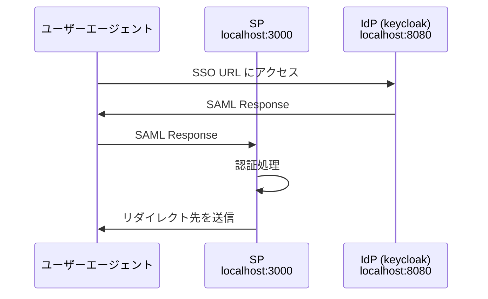

# SAML
IdP-initiated で SAML 認証する SP のサンプルアプリケーションです

# 注意
このサンプルアプリケーションは未実装の部分があり、不完全なアプリケーションなので注意が必要です。

- CSRF 対策などの不備
- レスポンスの署名未検証
- セッション期限未設定
- Single Logout 未対応


# 使い方

## 1. 前提条件
- Go 1.18 以上がインストールされていること
<!-- docker に変える？ -->

## 2. 起動
下記コマンドを実行すると、docker で keycloak が立ち上がり、ローカルで golang のアプリケーションが立ち上がります。

```bash
make run
```

## 3. IdP に SP のメタデータを登録
まずは SP ( http://localhost:3000 ) にログインして、必要となるメタデータを確認します。

（今回、SLO URL は表示していますが、使用しません）


次に別タブを開いて、 keycloak ( http://localhost:8080 ) にログインして、必要となるメタデータを登録します。


### IdP ログイン
下記情報で admin console にログインします。

- username: admin
- password: admin

### クライアントの作成
Clients > Create client でクライアントを作成します。

- Client type: SAML
- Client ID: SP で取得した SP Entity ID

### SSO URL の設定
作成したクライアントの設定画面から、IDP-Initiated SSO URL name を 1 にします。すると、SSO URL が下に表示されます。ここで Save ボタンを押しておきます。


### ACS URL の設定
Advanced タブを選択し、 Assertion Consumer Service POST Binding URL に、SP のページから取得した ACS URL を設定します。

### Client scope の追加
左タブの Client scopes を選択し、 Create client scope から新規にスコープを作成します。Name は他の名前でも問題ありません。

- Name: userprofile
- Type: Default
- Protocol: SAML

スコープを作成したら、Mappers から Configure a new mapper をクリックし、User Attribute を選択します。

Name, User Attribute, SAML Attribute Name を `email` にして保存します。


スコープの設定が完了したら、あとはクライアントにスコープを追加することで、作成した mapper の情報を取得することができます。

スコープを追加するには、左タブから Client を選択して、作成したクライアントを選択します。今度はクライアントの画面内にある Client scopes から、作成した scope を追加します。Assigned type は Default にしておきます。

### IdP ユーザーのメールアドレスの設定
左タブの Users を選択し、amdin ユーザーの設定画面に遷移します。そこでメールアドレスを設定します。今回は、SP に[1人のユーザー](https://github.com/ksrnnb/saml/blob/4374e251a8383a6c9626375ca15198eda790a65b/model/user.go#L22)しか保存していないので、メールアドレスは `demo@test.com` で登録しておきます。

## 4. SP に IdP のメタデータを登録
IdP の設定が完了したので、次は SP にメタデータを登録します。

### IdP のメタデータ取得
まずは IdP のメタデータを Realm settings のページでダウンロードします。


### メタデータ登録
ダウンロードした xml ファイルを、SP の設定ページからアップロードします。アップロードすると、フォームに自動入力されるようになっています。


## 5. ログアウトする
フローをわかりやすくするため、SP と IdP 両方ログアウトしておきます。

SP 側は、トップページから [2. SSO ログイン](http://localhost:3000/ssologin) にアクセスすると、ログアウトボタンが表示されます。

## 6. SAML 認証する
IdP-initiated の SSO URL にアクセスします。手順通りに行っていれば、SSO URL は http://localhost:8080/realms/master/protocol/saml/clients/1 になっています。

SAML 認証後、下の画面のように「SAML 認証に成功しました」というメッセージが出れば、SAML 認証が問題なく実行できています。


認証処理は、レスポンス中の `AttributeStatement` から email を探し、SP 側に登録済みのユーザーの中に同じ email のアカウントがあった場合は認証するように実装しています。

### SAML 認証シーケンス



## 7. 立ち下げ

```bash
make down
```
