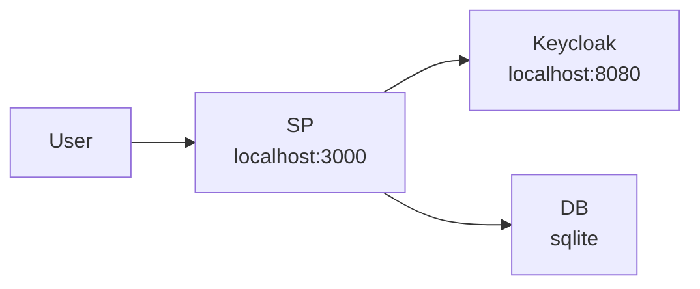
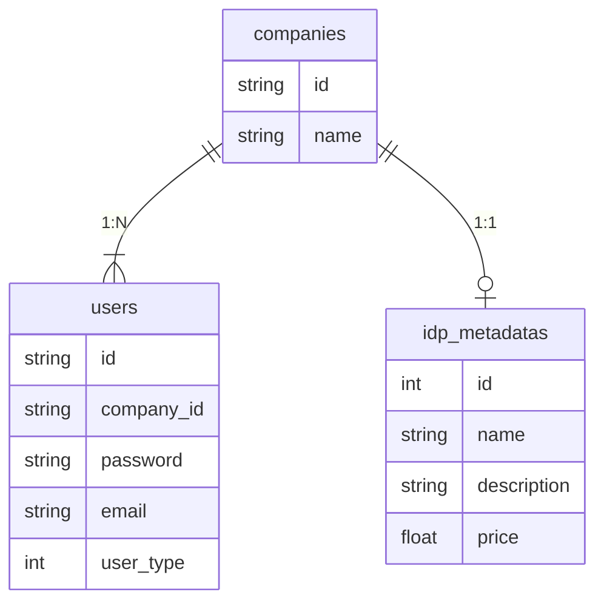
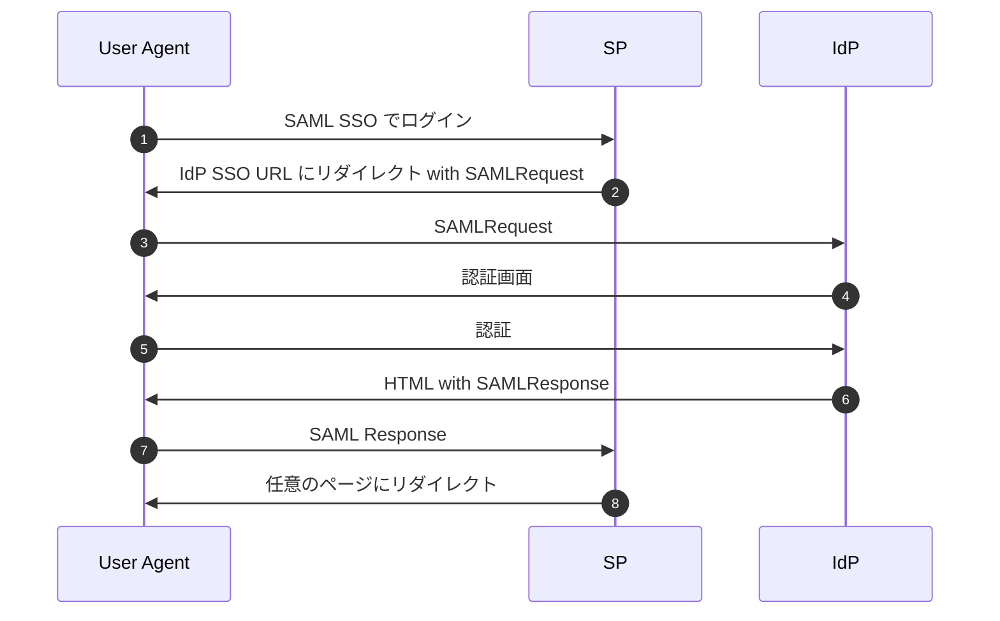
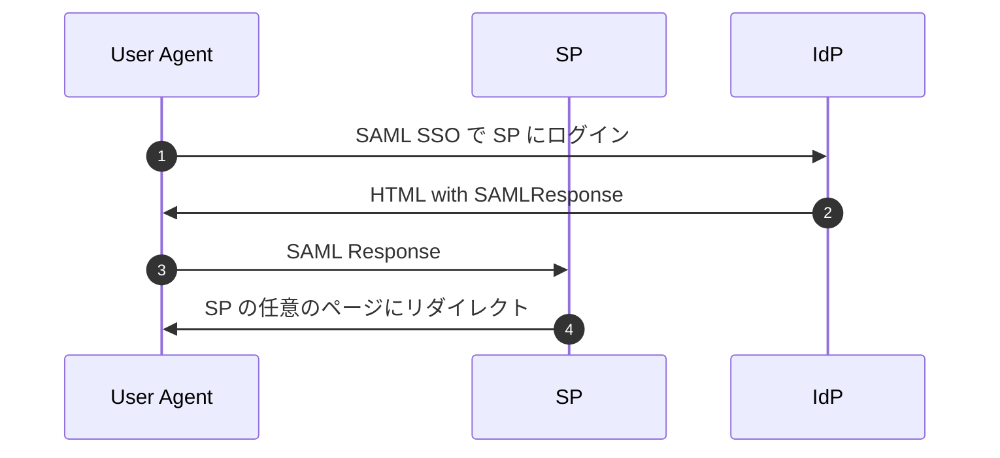
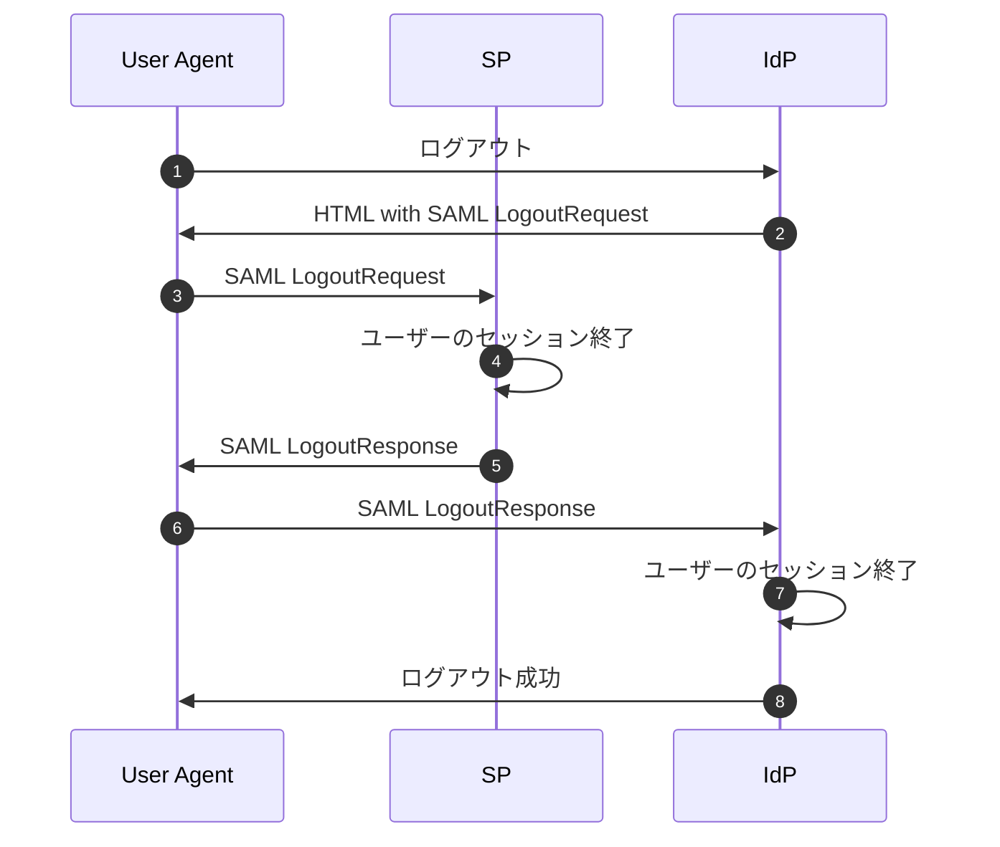
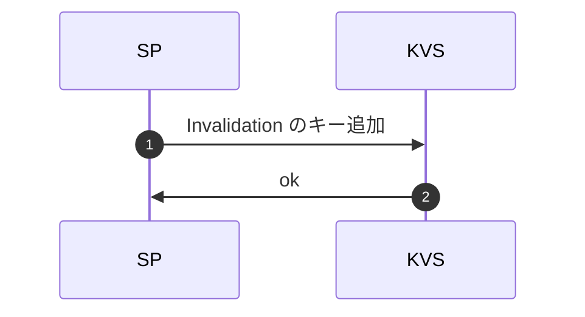
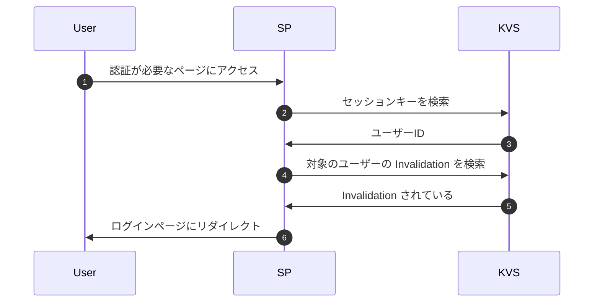
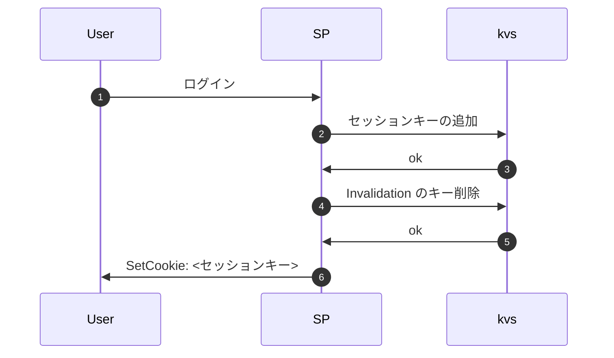

# 概要
会社に所属しているユーザーが SAML 認証でログインし、IdP 起点でログアウトができるようにする。今回は SP を実装し、IdP は Keycloak を Docker で利用する。

## 実装すること
- IdP メタデータの登録・更新
- SP-initiated SSO
- IdP-initiated SSO
- IdP-initiated Single Logout

## 実装しないこと
- ユーザーの追加・更新・削除
- 会社の追加・更新・削除
- Single Logout の署名（仕様では MUST）
- SP-initiated Single Logout
- persistent id への対応
- Just In Time Provisioning
- SAML 機能の有効化・無効化

# 詳細
## DB テーブル設計
会社に複数のユーザーが所属する。

今回は簡単のため、SAML 認証を有効にするかどうかのフラグはもたない。

## 認証
SP-initiated と IdP-initiated の両方に対応する。

### SP-initiated SSO

1. SAML SSO でログイン
2. IdP SSO URL にリダイレクトするレスポンスを返す。必要であれば、RelayState も返す。
    - このとき、Request の ID を Key Value Store に格納する。（セッションに追加しても ACS URL では Cookie が送られず、取得できないため。）
    - 今回は簡単のため、Key Value Store はインメモリとする。
3. そのままリダイレクトする。
4. IdP の認証画面を返す。認証済みの場合はスキップされる。
5. 認証する。
6. HTML レスポンスを返す。HTML には JavaScript のコードが含まれる。
7. JavaScript が実行され、HTTP POST Binding で SAMLResponse を ACS URL に送信する。
    - Cookie は送信されないので注意が必要（Cookie を送信したい場合は、SameSite 属性などの設定が必要となる）
    - このとき InResponseTo の値が 2. で格納した Key Value Store に存在するかどうか検証を行う。存在しない場合は不正なリクエストとして扱う。存在した場合は削除する。
8. RelayState に応じてリダイレクト先を決めて、レスポンスを返す。

### IdP-initiated SSO
SP-initiated とは異なり、3番の SAMLResponse を受け取った時、InResponseTo の検証ができない。これは CSRF 攻撃のリスクとなるので注意。[ritou さんの記事](https://zenn.dev/ritou/articles/9366cc534860e5) に分かりやすく記載されている。

## ログアウト
今回は IdP-initiated のみ対応する。また、仕様では署名が MUST であるが、簡単のため今回は対応しない。

ログアウト時、ユーザーの情報からセッションキーを推測することはできないので、Invalidation によりセッションを無効化する。

### IdP-initiated Single Logout

### セッションの invalidation
セッションを Invalidation することで、Single Logout を実現する。

#### Invalidation
ログアウト時に Key Value Store (KVS) に Invalidation のキーを追加する。キーは `invalidate:userId:<user_id>` とする。

#### Invalidation 後
Invalidation の後では、認証が必要なページにアクセスするとログインページにリダイレクトされる。

#### Invalidation 後のログイン
ログインした時に Invalidation のキーを削除する。

